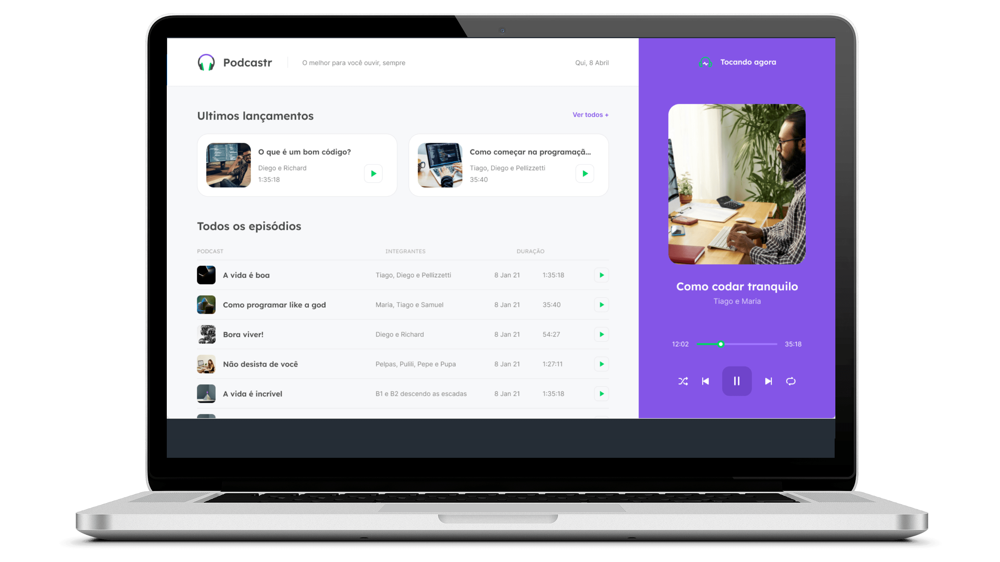
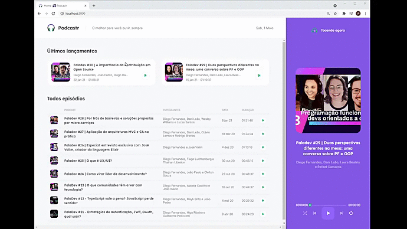
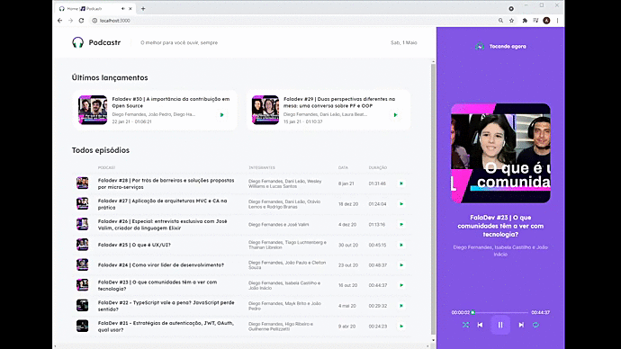

<!---------- Title/ Logo -------------->
<h1 align="center">
      
        Podcastr -next
  <!--//width="220px" /-->
</h1>

</h1>

<!-- ------- Ancoras --------------->
<p align="center">
  <a href="#-sobre">Sobre</a>&nbsp;&nbsp;&nbsp;|&nbsp;&nbsp;&nbsp;
  <a href="#-projeto">Projeto</a>&nbsp;&nbsp;&nbsp;|&nbsp;&nbsp;&nbsp;
  <a href="#-telas">Telas</a>&nbsp;&nbsp;&nbsp;|&nbsp;&nbsp;&nbsp;
  <a href="#-tecnologias">Tecnologias</a>&nbsp;&nbsp;&nbsp;|&nbsp;&nbsp;&nbsp;
  <a href="#-licença">Licença</a>
</p>

<!---------- Badges ----------------->  
<p align="center">
  
  
  
  
  
   
  <!--img src="https://img.shields.io/static/v1?label=made_by&message=Alex_Lima&color=6E40C9&labelColor=000000" alt="Alex Lima" />
  
  
  
  <!----(4953b8)--BlueDark -->
  <!----(49AA26)--Green -->
  <!----(008ed6)--Blue -->
  <!----(3292a6)--BlueMedium-->
  <!----(6E40C9)--Bluepurple-->
  </p>
<br>
<!---------- showcase  ----------------->  
<p align="center">
  
</p>

 <!----- Acess Deploy Demonstration-->
 <h5 align="center">
    🎬 Clique Aqui: &nbsp; <a href="https://podcastr-alxlima.vercel.app/">  Visualizar Demonstração </a> 
 </h5>


<!----- Description ------------------>
## 🔖 Sobre

 &nbsp;&nbsp;&nbsp;&nbsp;Este projeto é parte do evento que participei o **Next Level Week #5** conhecido como **NLW** da [Rocketseat](https://rocketseat.com.br). &nbsp;&nbsp;Foi uma semana de maratona de estudos sobre desenvolvimento Web(Front-End), em sua 5° edição. 
 
 &nbsp;&nbsp;&nbsp;&nbsp;O projeto denominado **PodCastr**, teve como objetivo criar uma aplicação que execute funções de player em arquivos de áudios, sendo reproduzidos no formato Podcast, basicamente você ira ouvir podcasts relacionados as principais novidades de tecnologias de informações, tendo como conteúdo atual apresentações de temas de bate papos do time e equipe RocketSeat e convidados especiais. &nbsp;&nbsp; A cada operação de play o arquivo e tema selecionado e executado automaticamente, tendo opções de repeat de um único áudio, ou podendo realizar um Shuffle Play, também existe uma pagina de detalhes de cada tema possibilitando a leitura inicial do podtcast que desejar ouvir.
  
  <br>

  ## 💻 Projeto

  &nbsp;&nbsp;&nbsp;&nbsp;A Construção e desenvolvimento foi através de arquitetura de componentes do **React.js** e **Next.js**, utilizando dependências das bibliotecas **TypeScript**, aplicando conceitos de utilização de componentes aplicados a contextos, que tem a vantagens de poder ser consumidos em requisições clientes **API** e a utilização de um Servidor **Json** que projeta a lista e conteúdo de Api episodios, em execução do player do podcastr, utilizando a biblioteca **Axios** para requisições Http. 
  
  &nbsp;&nbsp;&nbsp;&nbsp; Como arquitetura de desenvolvimento foi aplicado o conceito de **SSG** - Static Side Generation, incluindo boa praticas de tipagems e **SAS - CSS**.

<br>

 ###### **Evento :** Maratona -NLW 5ª Edição - [Rocketseat](https://rocketseat.com.br)
 ###### **Instrutor :** Diego Fernandes
<br>

<!----- Showcase Screens Shot------------------>
## 💻 **Telas**

<div align="center">



</div>
<br>
<br>

<!----- Configurations ---------------------------->
## 📌 Instruções : 

Para iniciar o Servidor API - JSON  use o comando:**_npm run server_**
Para iniciar o Servidor da aplicação use o comando: **_npm run dev_** então acesse pelo navegador **_http://localhost:3000/_** 


<br>

## 🚀 Tecnologias

- [HTML5](https://pt.wikipedia.org/wiki/HTML5) - Hyper Text Markup Language - linguagem de marcação de hipertexto.
- [SAS-CSS](https://sass-lang.com/) - Cascading Style Sheets - Estilização de código html.
- [React](https://reactjs.org/) - Biblioteca JavaScript para criação de Interfaces (Front-End)
- [Next.js](https://nextjs.org/) - Framework React com foco em produção e eficiência.
- [TypeScript](https://www.typescriptlang.org/) - Conjunto da linguagem JavaScript com definições de tipo estático.
- [Node.js](https://nodejs.org/en/) - Ambiente de execução Javascript server-side.
- [JSON](https://www.json.org/json-en.html) - JavaScript Object Notation - Tranferencia de dados cliente servidor.
- [VS Code](https://code.visualstudio.com/) - Editor de desenvolvimento de aplicações web.

<br>

## 📝 Licença
<a href="https://opensource.org/licenses/MIT">
    
</a>

 &nbsp;&nbsp;&nbsp;&nbsp;Esse projeto está sob a licença MIT. Veja o arquivo [LICENSE](https://opensource.org/licenses/MIT) para mais detalhes.

 <br>

## 📁 Como Baixar o Projeto

```bash
  # Clonar o repósitorio
  $ git clone https://github.com/alxlima/Podcastr-next
  
  # Entrar no diretório
  $ cd c:/nlw/podcastrnext 

  # Instalar as dependências
  $ npm install
  
  # Iniciar o Projeto
  $ npm run dev

  # Iniciar o Servidor Json emulate API
  $ npm run server

```
#
 Desenvolvido 🚀 por: ***_Alex Sandro da Silva lima_***


[](https://www.linkedin.com/in/alex-sandro-da-silva-lima-8b297839/) 
[](mailto:alex_lima2013@hotmail.com)

